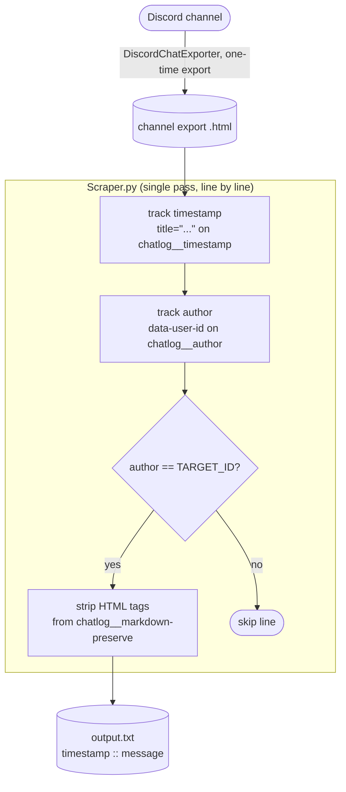

# Discord Bot-Data Scraper


-brightgreen)


A lot of Discord bots quietly post useful structured output into a channel over time (price alerts, trade signals, status logs, scrape results), but it's all **trapped in chat history**, interleaved with everyone else's messages. This pulls **one author's** messages (typically a bot's) back out of an exported channel and writes them to a clean, timestamped `timestamp :: message` text file you can actually parse.

No bot token, no gateway, no rate limits: you export the channel once with [DiscordChatExporter](https://github.com/Tyrrrz/DiscordChatExporter), point the script at the HTML, and it does the rest. It's a single dependency-free Python script, standard library only.

## What it does

- Reads a DiscordChatExporter **HTML** export, streaming it line by line
- Tracks the **current author and timestamp** as it walks the file
- Keeps only the messages whose author matches a single target user ID (`TARGET_ID`)
- **Strips the HTML tags**, leaving plain text
- Writes each surviving message to `output.txt` as `<timestamp> :: <message text>`
- Reports how many messages were extracted

## Architecture

One script, one direction of data flow. Discord is never contacted by the script: the entire contract is the HTML file that DiscordChatExporter writes to disk. The scraper reads that file and writes a text file; nothing else moves.



**How a run flows:**

1. **Export.** Use [DiscordChatExporter](https://github.com/Tyrrrz/DiscordChatExporter) to save the channel as an **HTML** file (not JSON, not the script's own `output.txt`).
2. **Find the author.** Open the export and locate the `data-user-id` attribute on a message from the bot/user you want. That number is the ID you'll target.
3. **Scan.** The script reads the export one line at a time. When it sees a `chatlog__timestamp`, it remembers the timestamp; when it sees a `chatlog__author` with a `data-user-id`, it remembers who's now speaking.
4. **Filter + clean.** On each `chatlog__markdown-preserve` (message body) line, it keeps the line **only if** the current author equals `TARGET_ID`, then strips all `<...>` tags down to plain text.
5. **Write.** Every kept message is appended to `output.txt` as `<timestamp> :: <message>`, and the final count is printed.

## Stack

| Layer | Technology |
|---|---|
| Language | Python 3 (standard library only, no `pip install`) |
| Parsing | `re`, three small regexes for timestamp, user ID, and tag stripping |
| Input | [DiscordChatExporter](https://github.com/Tyrrrz/DiscordChatExporter) HTML export |
| Output | Plain text, one `timestamp :: message` per line |

## Project layout

```
Scraper.py    # the entire tool: read export, filter by author, write output.txt
README.md     # this file
```

## Quick start

**Prerequisites:** Python 3 (anything modern) and a DiscordChatExporter HTML export. No packages to install, no API keys.

1. **Export the channel** with [DiscordChatExporter](https://github.com/Tyrrrz/DiscordChatExporter) in **HTML** format.

2. **Find the target author's user ID:** open the export, find a message from the bot/user you want, and copy the number in its `data-user-id` attribute.

3. **Configure the three values** at the top of `Scraper.py`:

   ```python
   html_file   = "discordchatexport.html"   # path to your HTML export (NOT output.txt)
   output_file = "output.txt"               # where to write results
   TARGET_ID   = "718992882182258769"       # the author you want to extract
   ```

4. **Run it:**

   ```bash
   python Scraper.py
   ```

   ```
   Done. Extracted 1423 messages.
   Saved to: output.txt
   ```

To pull a different author, change `TARGET_ID` and run it again.

## Configuration

Everything is set by editing the constants at the top of `Scraper.py`:

| Setting | Default | Purpose |
|---|---|---|
| `html_file` | `discordchatexport.html` | Path to the DiscordChatExporter **HTML** export to read |
| `output_file` | `output.txt` | Path to write the cleaned `timestamp :: message` lines |
| `TARGET_ID` | `718992882182258769` | The single `data-user-id` to keep messages from |

## Design decisions

- **Parse the HTML export, don't hit the Discord API.** Going through DiscordChatExporter's HTML means no bot token, no gateway access, and no rate limits, just read access to the channel and a one-time export. The trade-off is the parser keys off DiscordChatExporter's CSS class names (`chatlog__timestamp`, `chatlog__author`, `chatlog__markdown-preserve`), so a future change to their export format may need a regex tweak.
- **Stream line by line, don't load the whole file.** Channel exports get large. Reading the file a line at a time keeps memory flat regardless of how many months of history the export covers.
- **Track author as state across lines.** In the export, the author appears once and applies to the messages that follow until the next author. The script carries `current_user` forward so each message body is attributed correctly without re-parsing structure.
- **Filter by user ID, not username.** Usernames change and collide; the numeric `data-user-id` is stable and unambiguous, which matters when you're isolating exactly one bot.
- **Strip Markdown to plain text.** Bot output is usually structured data you're going to parse downstream, so the tags get stripped and you get clean text, easier to feed into the next script than styled HTML.
- **One author at a time, by design.** Keeping the filter to a single `TARGET_ID` keeps the output focused and the script trivial; re-running for another author is cheaper than building a multi-author mode you rarely need.

## Caveats

- **Coupled to DiscordChatExporter's format.** The regexes depend on its CSS class names; if the exporter changes its HTML structure, the matching may need updating.
- **HTML export only.** Point `html_file` at the HTML, not JSON, and not the script's own `output.txt` (a common mix-up the inline comment warns about).
- **Markdown is discarded.** You get plain text, not formatting. That's usually what you want for structured bot output, but it means links, code blocks, and emphasis are flattened.
- **One author per run.** Change `TARGET_ID` and re-run to extract a different author.
